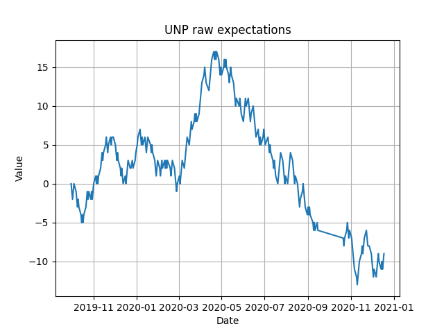
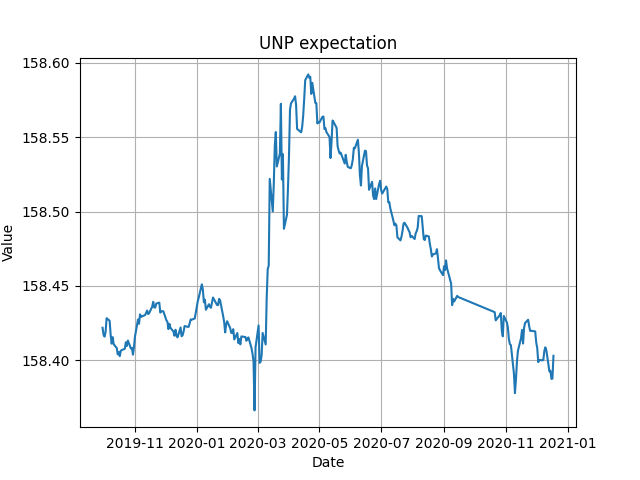

Used to combine the last 30 minutes of trade from each trading day into one big chart, with a variety of stocks. A test of the wall street theory that the last 30 minutes of trade is somewhat indicative of what is to happen the next day. This program was created to test that theory and see if any long term trends are present with such data. The program also gives percent changes for the real index and the expectations, and also includes a count of how many days were up and how may were down for the chosen stock. 



This chart simpily shows whether the given index moved either up or down in the last 30 minutes of trade. This is what was originally tracked in excel before this was turned into a python program.




This chart is the percent change of the chosen index in the lat 30 minutes of trade. 


Example Usage:

```bash
# Update all tickers
python3 update.py

# Updating an existing ticker, or add a new one:
python3 update.py --symbol TSLA

# Fetching Historical Data:
# Fetch last 5 months (max-months-to-fetch), not stopping even if we encounter data we already have (halt-mode)
python3 update.py --symbol TSLA --max-months-to-fetch 5 --halt-mode all
```
